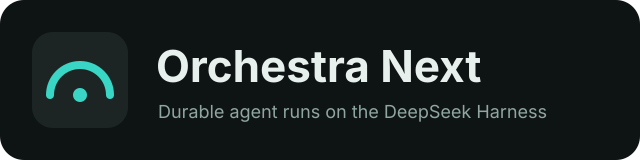
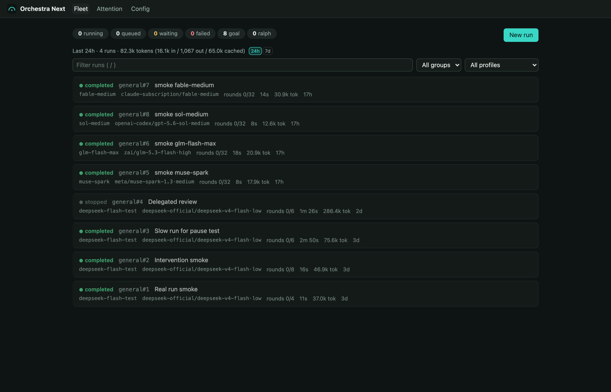
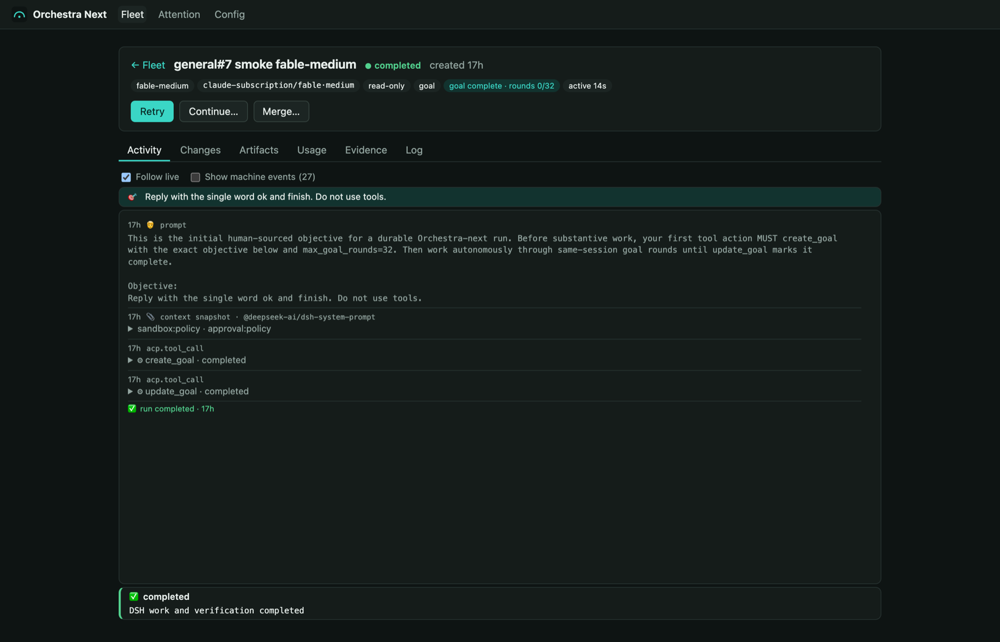
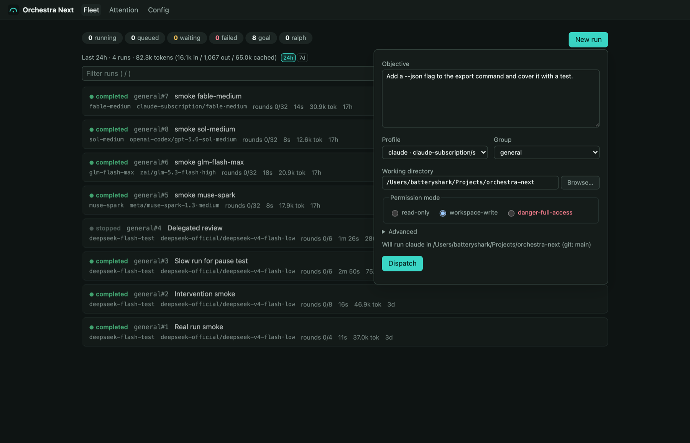
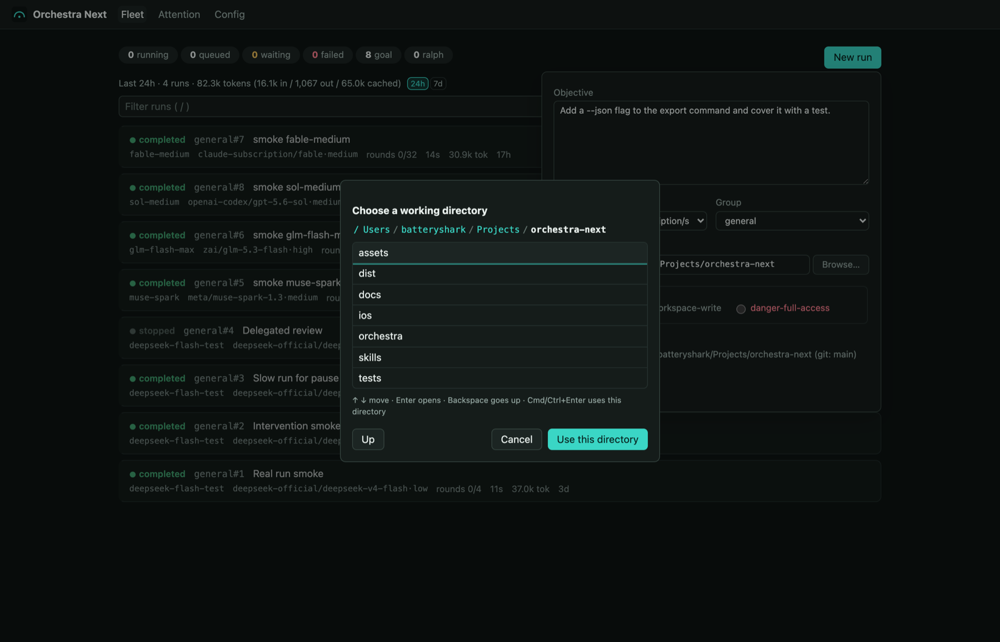
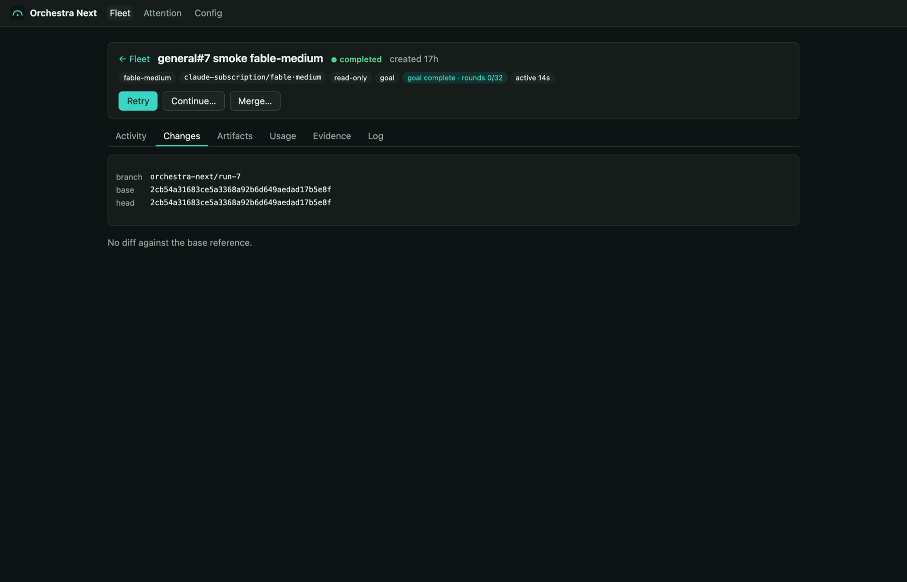
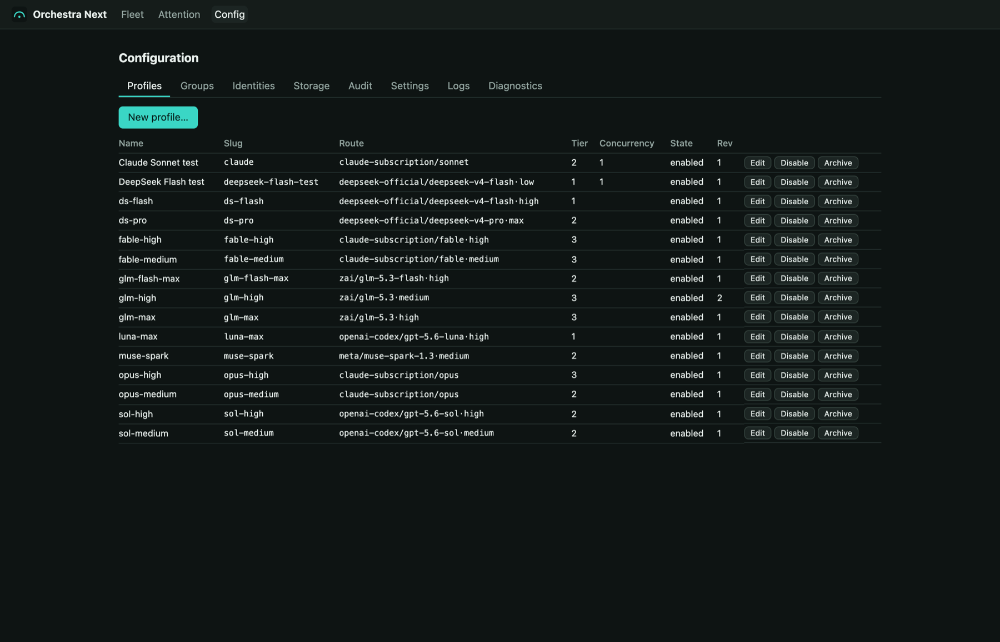
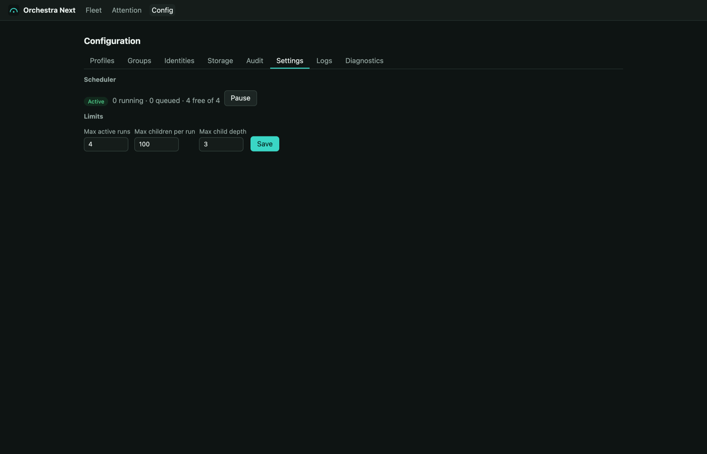
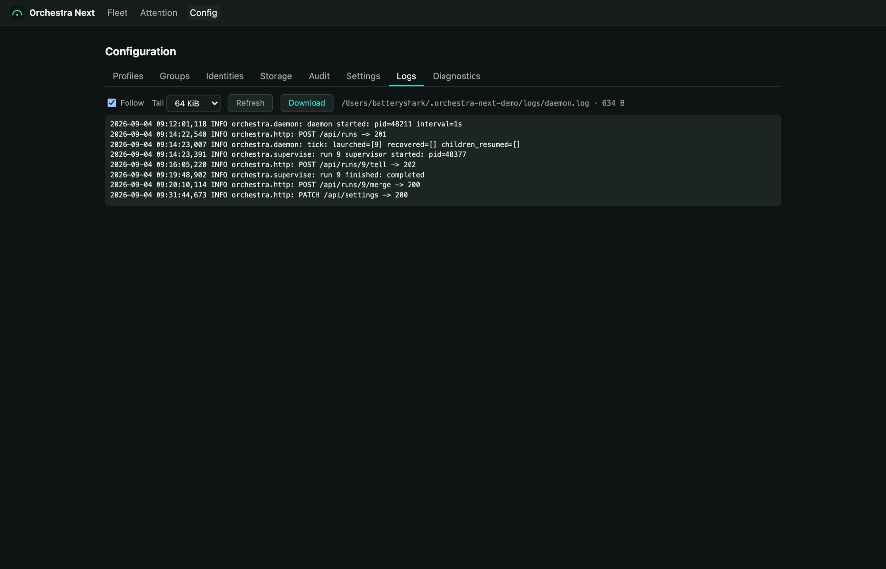

<p align="center">
  
</p>

<p align="center">
  <b>Durable agent runs for local fleets, built on the DeepSeek Harness.</b><br>
  Python 3.11+, standard library only. One SQLite file. A three-file browser console. No build step.
</p>

---

**Orchestra Next is a streamlined rewrite of Orchestra that leverages the [DeepSeek Harness (`dsh`)](https://github.com/deepseek-ai/deepseek-harness) as its only execution engine.** The previous Orchestra drove six different agent CLIs through six trace adapters. Orchestra Next keeps the fleet mechanics that proved useful (groups, dependencies, isolated Git worktrees, child runs, attention, artifacts, controls, callbacks, raw usage, event feeds) and gives them exactly one execution path:

```text
API / CLI  →  durable run  →  resident per-run DSH ACP process  →  the model you chose
```

Every model you can reach through DSH becomes a route: DeepSeek, Claude, GPT via Codex, Meta, Z.ai, or any OpenAI-compatible endpoint you declare in the profile patch. Orchestra Next validates every profile against DSH's live catalog, so a route that DSH cannot serve never reaches the scheduler.

## Screenshots

| Fleet | Run activity |
|---|---|
|  |  |

| New run | Directory picker |
|---|---|
|  |  |

| Changes | Profiles |
|---|---|
|  |  |

| Settings | Logs |
|---|---|
|  |  |

## What you get

- **Durable runs.** Each run is a row in SQLite, a Git worktree on its own branch, and one resident DSH process. Crashes recover; pauses checkpoint and release capacity; the same session resumes.
- **Fleet controls.** Tell, interrupt, pause, resume, reroute to another model mid-run, stop, stop the whole tree, retry, continue, merge the branch back into your checkout.
- **Attention inbox.** Questions, decisions, permission requests, alerts, and verification failures land in one inbox with leases so automated responders never collide.
- **Evidence.** Every DSH event, tool call, token count, checkpoint, diff, artifact, and control message is kept and browsable. Raw token facts only: no prices, no quota guesses.
- **Operator console.** Fleet, run detail with six sections, attention and messages, and a tabbed Config view (profiles, groups, identities and pairing, storage and prune, audit, settings, service logs, diagnostics). Keyboard driven.
- **Scheduler.** Global and per-profile concurrency, dependency conditions, child-run caps, and a pause switch. Limits are editable at runtime.
- **Self-update.** Config › Settings shows the running commit, checks `origin/main`, and fast-forwards plus restarts the daemon from the browser. Breaking changes are accepted.
- **Small footprint.** No Python dependencies. The console is `index.html`, `app.js`, and `app.css`. The daemon runs as a launchd service on macOS.

## Requirements

- Python 3.11 or newer
- DSH exactly `0.1.2-alpha.3` (`npm i -g @deepseek-ai/dsh@0.1.2-alpha.3`)
- Git
- Optional: Node/npm and the authenticated `claude` CLI for the Claude subscription route

## Setup

```sh
pip install -e .
orchestra-next init                        # state dir, first operator device, saved token
orchestra-next dsh setup                   # installs the orchestra-next DSH profile
orchestra-next dsh check --capabilities    # lists every route DSH advertises
orchestra-next service install --start     # macOS: run the daemon under launchd
```

Without the service, run `orchestra-next daemon` in a terminal. The daemon listens on `127.0.0.1:8766`, serves the console at `/`, and the API under `/api`. State lives in `~/.orchestra-next`. Override with `ORCHESTRA_NEXT_HOME` or the non-secret `bootstrap.json`.

Pair a browser: run `orchestra-next pair`, open the console, enter the code. On a tailnet, set `"trust_tailnet": true` in `bootstrap.json` and skip pairing (see [docs/API.md](docs/API.md)).

`dsh setup` installs the repository's `orchestra-next` profile under your existing DSH home. It never touches DSH credentials. The profile enables goals, compaction, jobs, skills, todo, native web search and fetch, and the normal shell and filesystem tools. Subagents, workflows, plan mode, and native elicitation are off. An explicit Ralph run loads the small `ralph.patch.yml` overlay.

## Routes and profiles

A profile is a named route: provider, model, optional reasoning effort, tier, and concurrency cap. The console's profile form and the API both read DSH's live catalog.

```sh
orchestra-next profile-create "DeepSeek worker" deepseek-official deepseek-v4-flash --slug ds-flash --tier 1 --effort high
orchestra-next run ds-flash "Implement and verify the requested change" --cwd /path/to/repo --verify python -m unittest
```

Providers come from `orchestra/dsh-profile/cordis.patch.yml`. DSH ships DeepSeek. The patch adds:

| Provider | Models | Credential |
|---|---|---|
| `claude-subscription` | haiku, sonnet, opus, fable (with efforts) | your `claude` login, through a per-run local sidecar |
| `openai-codex` | gpt-5.6-sol, gpt-5.6-luna | the Codex CLI's OAuth token |
| `meta` | muse-spark-1.3 | API key |
| `zai` | glm-5.3, glm-5.3-flash | API key |

API keys are read from OpenCode's `auth.json` when present and passed to DSH as environment variables. Add any OpenAI-compatible endpoint by declaring it in the patch; DSH advertises it on the next catalog refresh. See [docs/API.md](docs/API.md) for the `worker_env` allowlist.

The Claude subscription sidecar is for private evaluation. Anthropic's Agent SDK terms require approval before a third-party product offers claude.ai login; use an API-key route for public deployment unless that approval exists.

Migrating from the previous Orchestra: `orchestra-next profiles-import-v2` maps the old profiles onto DSH routes, reports what it can and cannot route, and creates them with `--apply`.

## Console

Three static files under `orchestra/ui/`. Fleet with status chips, a usage strip, filters, and the New run form with a host directory picker. Run detail: Activity, Changes, Artifacts, Usage, Evidence, Log. Attention with a Messages ledger. Config with eight tabs.

Keyboard: `/` filter, `n` new run, `j` `k` move, `Enter` open, `t` direct a run, `1`–`6` run sections, `[` `]` cycle sections or Config tabs, `Esc` back. Details in [docs/CONSOLE.md](docs/CONSOLE.md).

## Run behavior

A goal run must create a DSH goal before substantive work. DSH drives continuation rounds inside the same process and session. Orchestra Next reconciles the session JSONL by `(session_id, seq)`: goal state, rounds, messages, tool lifecycle, compaction, and exact input, output, and cache token counts.

Transient process failure gets one same-session resume. Questions and child waits checkpoint the worktree, stop DSH, release capacity, and later resume the same session. Permission requests park the ACP process for up to ten minutes while releasing scheduler capacity. Rerouting cancels current activity, changes the ACP model, increments the cache epoch, and continues the same goal.

Completion checkpoints Git evidence and runs the optional verifier as a direct argv. A failed verifier gets up to two repair cycles in the same DSH session; continued failure opens attention instead of marking the run complete.

Workers talk back through bridge commands that infer the run from their environment:

```sh
orchestra-next ask "Which deployment target should I use?"
orchestra-next child ds-flash "Investigate the failing subsystem"
orchestra-next artifact reports/result.json
```

Worker credentials live in run-owned `0600` files. Bearer tokens never enter DSH's environment.

## Operations

```sh
orchestra-next service status | restart | uninstall
orchestra-next settings list                 # max_active_runs, child caps, paused
orchestra-next settings set max_active_runs 6
orchestra-next pause "provider incident"     # scheduler admits nothing; running runs continue
orchestra-next resume-scheduler
orchestra-next backup [dest]                 # consistent DB copy + bootstrap + artifacts + sha256 manifest
orchestra-next restore <backup> --apply      # verifies digests, moves current state to trash, never deletes
orchestra-next storage                       # size report; prune plans are dry-run then apply
orchestra-next update --check                # commits behind origin/main; `update` fast-forwards
```

Service logs: `~/.orchestra-next/logs/daemon.log`, also tailed in Config › Logs. Each run's raw ACP stream is under its run section Log.

## Tests

```sh
python run_tests.py
```

The suite uses a deterministic fake ACP server and makes no provider or network calls.

## Documentation

- [DESIGN.md](DESIGN.md): ownership boundaries and what stays out of scope
- [docs/API.md](docs/API.md): the HTTP and CLI surface
- [docs/CONSOLE.md](docs/CONSOLE.md): console maintainer notes
- [docs/UI_PROPOSAL.md](docs/UI_PROPOSAL.md): the operator interface proposal
- [docs/ANTIGRAVITY_SPIKE.md](docs/ANTIGRAVITY_SPIKE.md): the evaluated Antigravity delegation boundary

## License

MIT. See [LICENSE](LICENSE).
